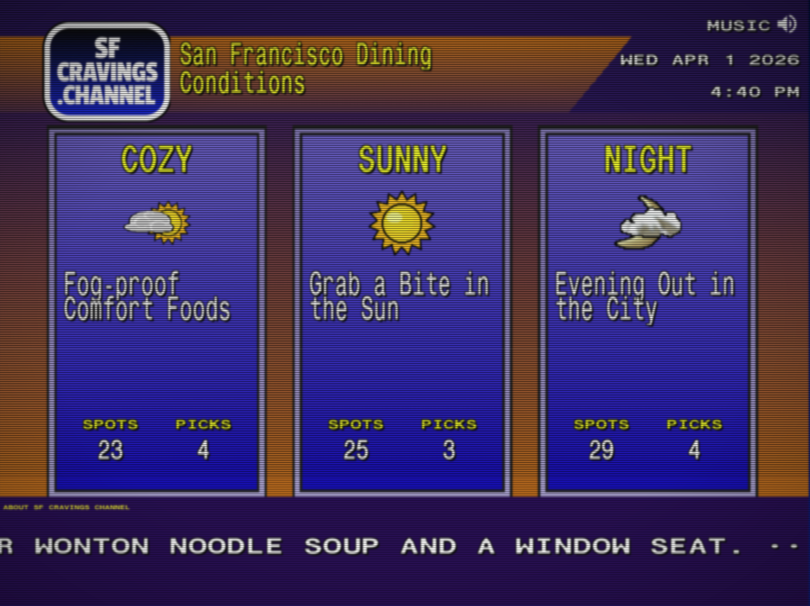

# Cravings Forecast

A curated restaurant guide styled after the 90s Weather Channel "Local on the 8s" broadcast. Pick a weather condition and get restaurant recommendations that match the vibe. Fully responsive — works on desktop and mobile.

**Live demo:** [sfcravings.channel](https://sfcravings.channel/)



## The Concept

Users choose a weather condition — **Foggy**, **Sunny**, or **Night** — and see a curated list of restaurants that fit the mood. Wonton soup for foggy days, ice cream for sunny ones, late-night eats when the sun goes down.

The entire UI is styled to look like the WeatherStar 4000 system: Star4000 fonts, WS4000 color palette, scanline overlays, scrolling crawl bar, and background music. The desktop layout recreates the classic 4:3 broadcast look, while the mobile layout adapts the retro aesthetic for small screens with custom backgrounds and a fixed header/crawl bar.

## Make It Your Own

This project is designed to be forked for any city. To customize it:

1. **Update the seed data** — Edit `server/db/seed.sql` with your city's neighborhoods, cuisines, and restaurants
2. **Swap the branding** — Replace the logo in `src/assets/images/` and update the site title in `src/index.html`
3. **Change the conditions** — The default conditions (Foggy/Sunny/Night) are San Francisco-specific. Edit the `condition_meta` seed data and condition icons to match your city's personality (Rainy/Snowy/Humid, etc.)
4. **Update SEO** — Replace the domain and metadata in `src/index.html` and `server/routes/seo.ts`
5. **Swap the background music** — Replace `src/assets/audio/background.mp3` with your own loop
6. **Add your restaurants** — Use the admin panel, the Excel import script in `scripts/`, or an AI agent via the API

## Manage Restaurants with an AI Agent

The site includes a full REST API and a set of workflow instructions in `ai-agent/` designed for AI coding assistants like [OpenClaw](https://github.com/nichochar/open-claw), Claude Code, or any tool that can make HTTP requests. Point your agent at [`ai-agent/README.md`](ai-agent/README.md) and it can:

- **Research and add restaurants** — the agent verifies the restaurant exists, finds the website, matches the cuisine and neighborhood to existing data, writes an opinionated description, and confirms with you before creating
- **Edit or remove restaurants** — fuzzy name matching, diff-style confirmation
- **Write crawl messages** — brainstorm mode generates options in the site's voice
- **Manage cuisines and neighborhoods** — full CRUD with conflict protection

Every write operation requires explicit user confirmation. See the [workflow docs](ai-agent/) for the full playbook.

## Tech Stack

| Layer | Technology |
|-------|------------|
| Frontend | Preact + preact-iso (SPA routing), SCSS, vanilla TypeScript |
| Backend | Hono on Node.js |
| Database | SQLite via better-sqlite3 |
| Build | Vite |
| Fonts/Assets | Star4000 fonts and WS4000 palette from [ws4kp](https://github.com/netbymatt/ws4kp), plus original assets for mobile |

## Getting Started

```bash
# Install dependencies
npm install

# Copy environment config
cp .env.example .env
# Edit .env — generate secrets with: openssl rand -hex 32

# Initialize the database with sample data
# The server auto-creates the DB from schema.sql + seed.sql on first run

# Start dev servers (two terminals)
npm run dev          # Vite frontend (HMR)
npm run dev:server   # Hono API server (auto-restart)
```

Open http://localhost:5173 (Vite proxies API calls to the backend).

## Production

```bash
# Build frontend
npm run build

# Start production server (serves API + static build)
npm start
```

Or use Docker:

```bash
cp .env.example .env
# Edit .env with production secrets
docker compose up -d
```

The app runs on port 3001 by default. Put a reverse proxy (Caddy, nginx) in front for HTTPS.

## Environment Variables

| Variable | Description |
|----------|-------------|
| `PORT` | Server port (default: 3001) |
| `SESSION_SECRET` | Secret for signed cookies — generate with `openssl rand -hex 32` |
| `ADMIN_PASSWORD_HASH` | bcrypt hash of admin password — generate with `node -e "require('bcrypt').hash('yourpass',10).then(console.log)"` |
| `API_TOKEN` | Bearer token for the REST API — generate with `openssl rand -hex 32` |

## Admin Panel

Navigate to `/admin` and log in with your admin password. From there you can:

- Add, edit, and remove restaurants
- Manage cuisines and neighborhoods
- Edit condition descriptions and tags
- Update the scrolling crawl bar messages
- Edit the About page content (markdown)

## Project Structure

```
server/
  index.ts          # Hono server entry point
  db/
    schema.sql      # Database schema
    seed.sql        # Sample data (customize this!)
    index.ts        # Database connection + queries
  routes/           # API route handlers
  middleware/        # Auth middleware
src/
  index.html        # SPA entry point
  main.tsx          # Preact app mount
  app.tsx           # Router
  routes/           # Page components
  components/       # Shared UI components
  styles/           # SCSS (ws4kp-derived)
  assets/           # Fonts, images, audio
scripts/            # Data import utilities
ai-agent/           # AI assistant workflow instructions
```

## Credits

- Some fonts, backgrounds, and SCSS partials derived from [ws4kp (WeatherStar 4000+)](https://github.com/netbymatt/ws4kp) by Matt Walsh, MIT License
- Star4000 fonts by Nick Smith ([TWCClassics.com](https://twcclassics.com))

## License

MIT — see [LICENSE](LICENSE).
